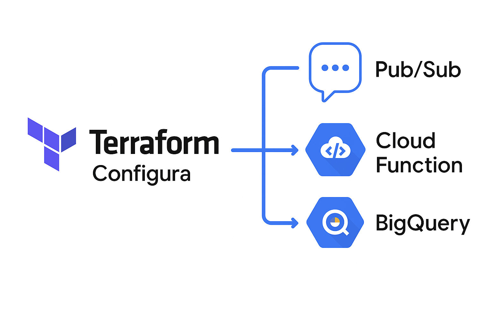

# ☁️ Terraform GCP Data Pipeline

A fully serverless and free data pipeline on **Google Cloud Platform**, built with **Terraform**.  
It uses:

- **Pub/Sub** to ingest events
- **Cloud Function** to process and forward them
- **BigQuery** to store structured results

Everything is provisioned using **Infrastructure as Code (IaC)**.

---

## 📌 Architecture

```
Terraform → Pub/Sub → Cloud Function → BigQuery
```



---

## ⚙️ What This Project Does

Using a single `terraform apply`, this project will:

1. Create a GCS bucket to upload function code.
2. Create a Pub/Sub topic for data ingestion.
3. Create a BigQuery dataset and table.
4. Deploy a Cloud Function (Python) that:
   - Is triggered by Pub/Sub messages
   - Parses incoming JSON
   - Inserts each record into BigQuery
5. Grant IAM roles to the Cloud Function to allow Pub/Sub + BigQuery access.

---

## 🚀 Step-by-Step Guide

### 1. **Clone the repository**

```bash
git clone https://github.com/gustavopiroupo/terraform-gcp-data-pipeline.git
cd terraform-gcp-data-pipeline
```

### 2. **Install prerequisites**

Make sure you have:

- [Terraform CLI](https://developer.hashicorp.com/terraform/downloads) installed (`>= 1.5.0`)
- [Google Cloud CLI (gcloud)](https://cloud.google.com/sdk/docs/install)
- A GCP project with billing enabled
- The following APIs enabled in your GCP project:
  - Cloud Functions API
  - Cloud Storage
  - Pub/Sub
  - BigQuery

### 3. **Set up authentication**

```bash
gcloud auth login
gcloud auth application-default login
gcloud config set project your-gcp-project-id
```

### 4. **Run Terraform**

You will now create all resources in your GCP project using Terraform.

> Make sure to replace `your-gcp-project-id` with your **actual Google Cloud Project ID**.  
> You can find it in the [GCP Console](https://console.cloud.google.com/) homepage — it's usually something like `data-pipeline-392818`.

```bash
terraform init

terraform apply -var="project_id=your-gcp-project-id"


### 5. **Test the pipeline**

```bash
gcloud pubsub topics publish data-topic   --message='{"id":"123", "message":"Hello from PubSub"}'
```

```sql
SELECT * FROM `your-gcp-project-id.demo_dataset.events` ORDER BY timestamp DESC;
```

### 🧹 Tear down everything

```bash
terraform destroy -var="project_id=your-gcp-project-id"
```

---

## 📁 Project Structure

```bash
terraform-gcp-data-pipeline/
├── cloudfunction/
│   ├── main.py
│   └── requirements.txt
├── main.tf
├── variables.tf
├── outputs.tf
├── gcs.tf
├── pubsub.tf
├── bigquery.tf
├── function.tf
├── iam.tf
├── docs/
│   └── architecture.png
└── README.md
```

## ✅ Message format

```json
{
  "id": "string",
  "message": "string"
}
```

## 👤 Author

Built by [@gustavopiroupo](https://www.linkedin.com/in/gustavo-piroupo/)  
**Senior Data Engineer • GCP Certified**

## 📝 License

MIT — use it freely, clone it, adapt it.